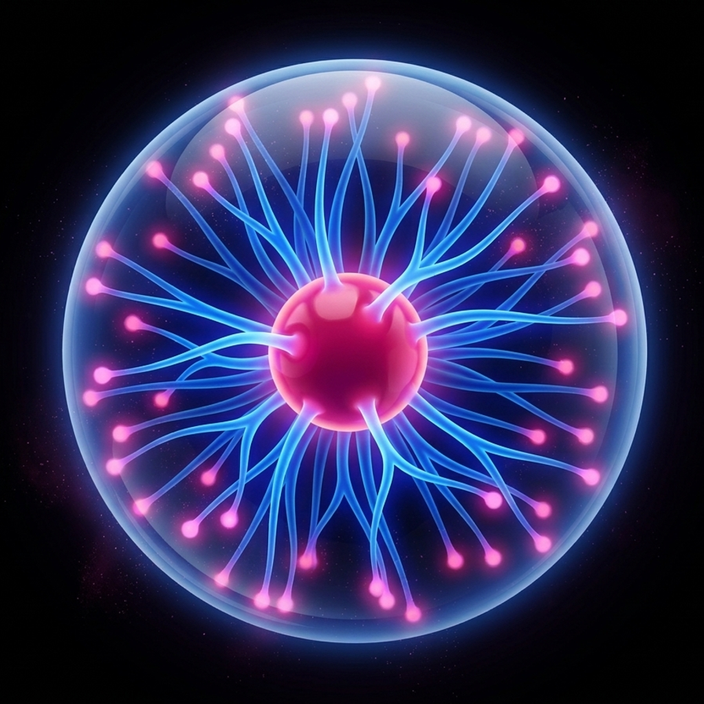
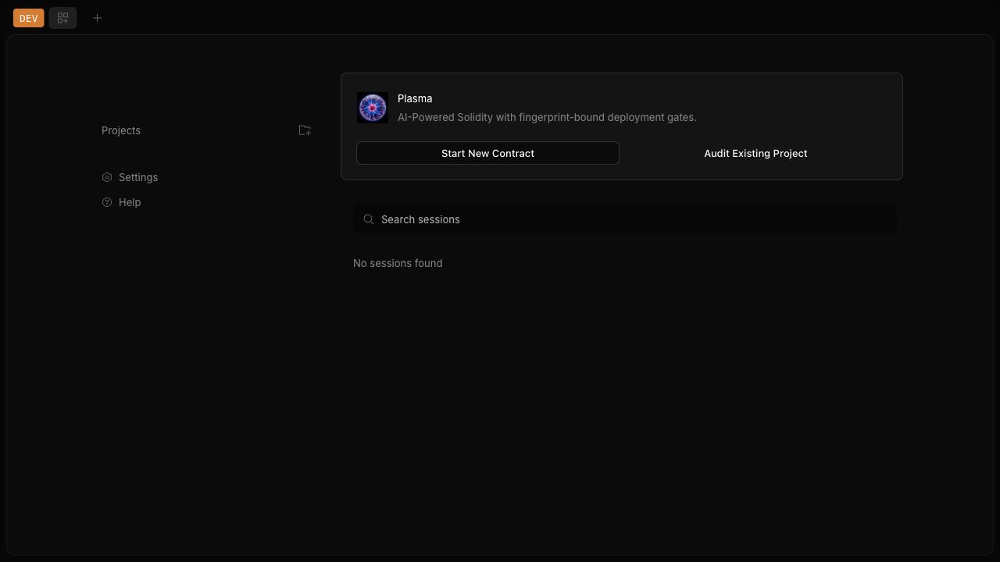
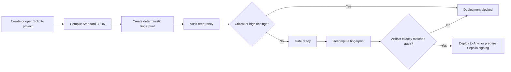

# Plasma

<p align="center">
  
</p>

**AI-Powered Solidity**

[](https://github.com/CYPHES-ATP/Plasma/releases/latest)
[](LICENSE)
[](https://docs.soliditylang.org/)

Plasma is a security-first IDE and CLI for Solidity development. It preserves
OpenCode's proven application shell, agent runtime, sessions, permissions,
providers, file handling, terminal, and tool APIs, then adds a focused smart
contract workflow:

```text
Create -> Compile -> Audit -> Fix -> Gate -> Deploy
```

The core guarantee is deliberately narrow:

> Plasma blocks deployment inside Plasma when the exact compiled artifact has
> unresolved critical or high-risk findings, has not been audited, or has
> changed since its audit.

Plasma does not claim formal verification, does not make contracts
"bulletproof," and cannot prevent deployment through tools outside Plasma.

## Highlights

- Plasma-branded desktop, web, and dark-first terminal interface
- `CYPHES` security copilot using the configured provider/model layer
- Foundry-style secure project initialization
- Solidity Standard JSON compilation with `solc 0.8.26`
- Import resolution for workspace and installed dependencies
- Deterministic fingerprints over sources, dependencies, compiler settings,
  EVM settings, and generated bytecode
- Focused reentrancy audit with strict structured output
- Approval-gated minimal fix proposals
- Fingerprint-bound deployment enforcement
- Exact-artifact deployment to local Anvil
- Sepolia transaction preparation and external wallet signing
- Mainnet deployment intentionally disabled

## Desktop GUI

Plasma includes a native desktop application for macOS, Windows, and Linux,
built on the same security runtime as the CLI. The GUI provides project and
session navigation, the CYPHES copilot, file and terminal workflows, and a
dedicated Compile, Audit, Gate, and Deploy security workspace.



Tagged desktop releases are published on the
[GitHub Releases page](https://github.com/CYPHES-ATP/Plasma/releases). The
macOS release job requires a Developer ID certificate and notarization
credentials, then verifies the signed artifact with `codesign` and Gatekeeper
before publication. Source builds and explicitly marked preview builds are not
equivalent to signed public releases.

## Security Workflow



## Quick Start

### From source

Requirements:

- Git
- [Bun 1.3.14](https://bun.sh/)
- macOS, Linux, or Windows
- [Foundry](https://book.getfoundry.sh/getting-started/installation) for Anvil

```bash
git clone https://github.com/CYPHES-ATP/Plasma.git
cd Plasma
bun install --frozen-lockfile
bun run dev .
```

Start the desktop application:

```bash
bun run dev:desktop
```

Create an unsigned local macOS preview for development:

```bash
OPENCODE_CHANNEL=prod bun --cwd packages/desktop build
OPENCODE_CHANNEL=prod bun --cwd packages/desktop package:mac:unsigned
```

Build a native CLI:

```bash
bun run build:cli
find packages/opencode/dist -path '*/bin/plasma*' -type f
```

The generated directory uses `darwin-arm64`, `darwin-x64`, `linux-arm64`,
`linux-x64`, or the equivalent Windows target. See
[Installation](docs/INSTALLATION.md) for exact platform instructions.

### Release installer

After the first tagged release is published:

```bash
curl -fsSL https://raw.githubusercontent.com/CYPHES-ATP/Plasma/main/install | bash
```

The installer places `plasma` in `~/.plasma/bin` and creates an `opencode`
compatibility alias for existing scripts.

Upgrade an installer-managed release with:

```bash
plasma upgrade
```

`plasma upgrade` resolves versions from this repository's GitHub releases and
uses the Plasma installer. It does not install an upstream OpenCode package.

## Using Plasma

Launch Plasma in a Solidity workspace:

```bash
plasma /path/to/project
```

Inside the CYPHES chat, use:

```text
/plasma new
/plasma compile
/plasma audit
/plasma status
/plasma fix <finding-index>
/plasma deploy local
/plasma deploy sepolia
```

The Security Workspace presents the same lifecycle as Compile, Audit, Gate, and
Deploy sections.

### Local deployment

Start Anvil:

```bash
anvil
```

Compile and audit the current fingerprint, then run:

```text
/plasma deploy local
```

Plasma connects to `http://127.0.0.1:8545`, verifies chain ID `31337`, enforces
the gate in the deployment function, and records address, transaction hash, gas
used, and fingerprint.

### Sepolia deployment

Plasma never asks for a private key. It prepares the exact audited deployment
transaction for chain ID `11155111` and requests signing from a supported
external wallet. When an injected wallet is unavailable, Plasma exposes the
signing request for a supported external flow.

Mainnet is not available.

## Project Configuration

`plasma.json` defines compiler, audit, and supported network settings:

```json
{
  "contracts": ["contracts/**/*.sol"],
  "compiler": {
    "version": "0.8.26",
    "optimizer": true,
    "runs": 200
  },
  "audit": {
    "blockOn": ["critical", "high"]
  },
  "networks": {
    "local": {
      "rpcUrl": "http://127.0.0.1:8545",
      "chainId": 31337
    },
    "sepolia": {
      "chainId": 11155111
    }
  }
}
```

Invalid, unsupported, or mainnet-like configuration is rejected.

## Architecture

Plasma-specific runtime code is isolated in:

```text
packages/opencode/src/plasma/
packages/opencode/src/tool/plasma.ts
packages/opencode/src/server/routes/instance/httpapi/groups/plasma.ts
packages/opencode/src/server/routes/instance/httpapi/handlers/plasma.ts
packages/app/src/pages/plasma.tsx
packages/opencode/test/plasma/
```

Use `PLASMA_SERVER_USERNAME` and `PLASMA_SERVER_PASSWORD` for remote server
authentication. Internal `@opencode-ai/*` packages, legacy `OPENCODE_*`
environment variable fallbacks, `.opencode` extension directories, provider
IDs, and `opencode.json` remain where changing them would break upstream
compatibility or existing user data. They are implementation contracts, not
the visible product identity.

Read [Architecture](docs/ARCHITECTURE.md) and
[Security Model](docs/SECURITY-MODEL.md) for the full boundaries.

## Verification

```bash
bun run verify:plasma
```

The focused suite validates initialization, compilation, deterministic
fingerprints, reentrancy detection, stale-audit behavior, deployment blocking,
exact audited artifact readiness, and safe Sepolia signing requests.

The vulnerable demonstration fixture is in
`packages/opencode/test/fixture/plasma-vault`.

## Production Status

The repository contains the complete MVP implementation, tests, installer,
fork-safe CI, and CLI and desktop release automation. Before declaring an
externally hosted production release, complete the operational checklist in
[Production Readiness](docs/PRODUCTION.md), including:

- independent security review
- signed/notarized desktop artifacts
- protected release environment and secrets
- funded Sepolia wallet acceptance test
- release rollback and incident-response ownership

The active workflow definitions live under `.github/workflows` in the source
checkout and are mirrored in [Workflow Templates](docs/workflows/README.md).
GitHub credentials used to publish or activate those files must include the
separate `workflow` permission.

## Documentation

- [Installation](docs/INSTALLATION.md)
- [Architecture](docs/ARCHITECTURE.md)
- [Security Model](docs/SECURITY-MODEL.md)
- [Production Readiness](docs/PRODUCTION.md)
- [Release Guide](docs/RELEASE.md)
- [Workflow Templates](docs/workflows/README.md)
- [Contributing](CONTRIBUTING.md)
- [Security Policy](SECURITY.md)

## Attribution

Plasma is a derivative work based on
[OpenCode](https://github.com/anomalyco/opencode), licensed under the MIT
License. OpenCode remains the architectural chassis; Plasma is not affiliated
with or endorsed by the OpenCode maintainers. Required notices are retained in
[LICENSE](LICENSE) and [NOTICE](NOTICE).
