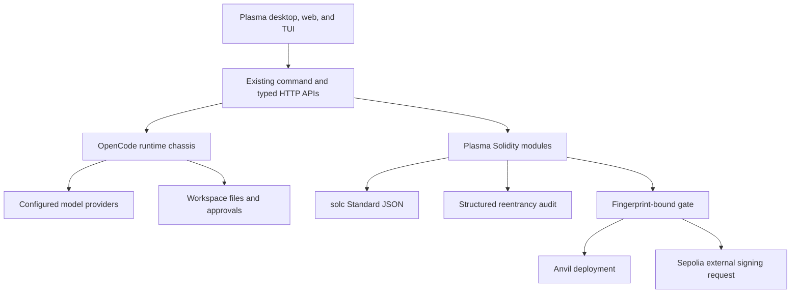

# Plasma Architecture

## Design Principle

OpenCode is the chassis. Plasma adds Solidity security capabilities through
isolated modules and existing extension points instead of replacing the agent,
session, provider, terminal, file, permission, or UI systems.

## Runtime Layers

## Plasma Modules

- `config.ts`: validates `plasma.json` and supported networks
- `project.ts`: creates the Foundry-style starter workspace
- `compiler.ts`: resolves sources/imports, compiles Standard JSON, normalizes
  diagnostics, stores artifacts, and creates fingerprints
- `analyzer.ts`: deterministic reentrancy guardrail used in tests and audit
  validation
- `audit.ts`: invokes the configured model layer and rejects malformed output
- `gate.ts`: computes fail-closed deployment readiness
- `fix.ts`: creates minimal approved patch proposals
- `deploy.ts`: revalidates and deploys exact audited artifacts
- `storage.ts`: stores build, audit, and session deployment records

## Fingerprint Contract

The build fingerprint changes when source, imported dependencies, compiler
version, optimizer settings, EVM settings, or generated bytecode changes.

Audit records store the build fingerprint and per-artifact bytecode hashes.
Deployment recompiles, re-evaluates the gate, and verifies the selected
bytecode hash before preparing or broadcasting a transaction.

## Compatibility Surface

The following upstream identifiers are retained intentionally:

- `@opencode-ai/*` package names
- legacy `OPENCODE_*` runtime environment variable fallbacks
- `opencode.json` and `.opencode` extension/config paths
- upstream provider IDs

Changing these would break runtime APIs, persisted settings, plugins, or
upstream mergeability. New user-facing product surfaces use Plasma, including
the primary `PLASMA_SERVER_USERNAME` and `PLASMA_SERVER_PASSWORD` variables.

The packaged desktop process is an intentional isolation boundary: it assigns
desktop-owned XDG data/config/cache/state roots, ignores inherited CLI
port/database/auth overrides, selects a free loopback port, and authenticates
its renderer and bundled sidecar with the same Plasma credentials. The CLI
installer exposes only the `plasma` command and never places a compatibility
`opencode` executable on `PATH`.

## Wallet Boundary

Plasma does not hold a Sepolia private key. The backend prepares chain ID,
calldata, and value for the exact audited bytecode. A supported external wallet
performs signing and broadcast. Mainnet is absent from the configuration schema.
